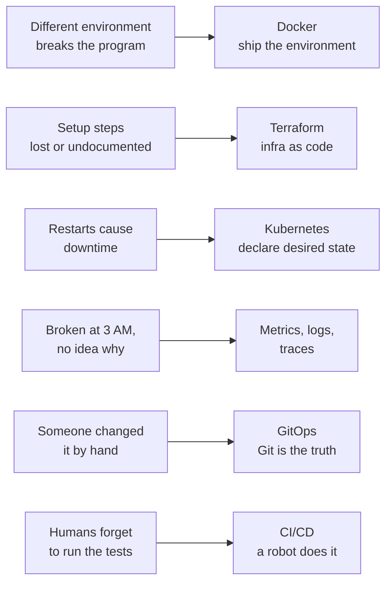
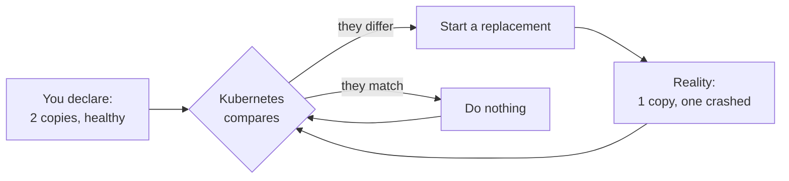
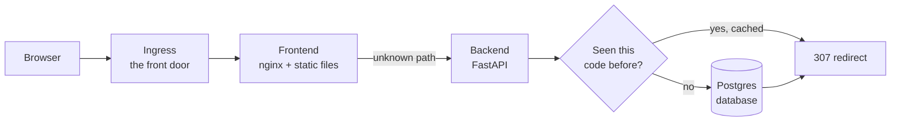
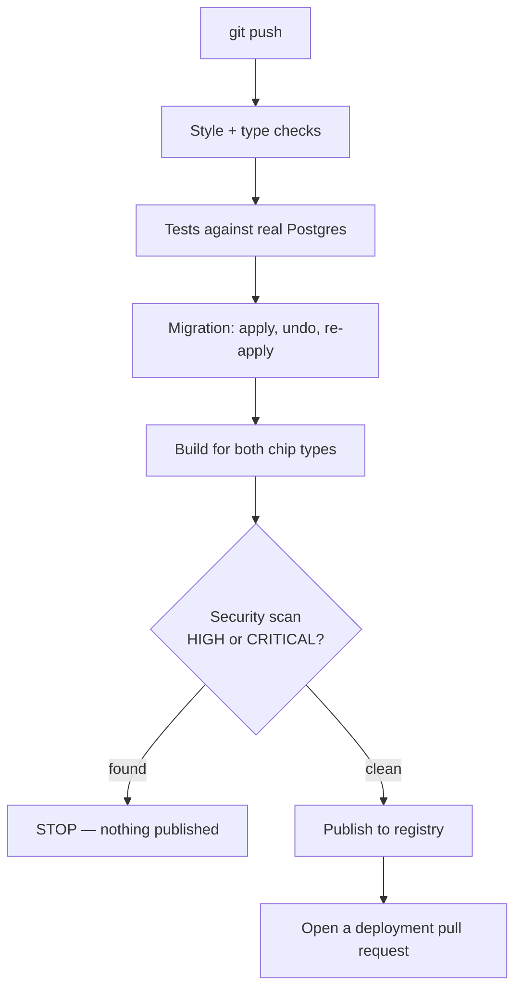
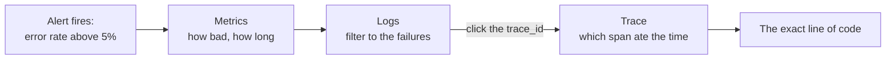
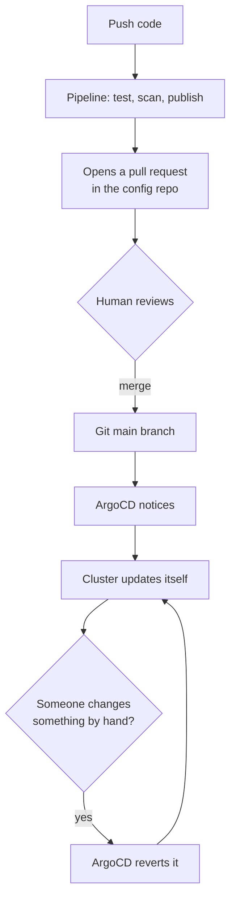

# The DevOps pipeline, explained from zero

*Every tool, what it actually does, why it exists, and what broke when we used
it for real. If you know the names — Docker, Kubernetes, Terraform — but not
what happens inside them, start here.*

---

## Contents

1. [Why any of this exists](#why-any-of-this-exists)
2. [The vocabulary, properly explained](#the-vocabulary-properly-explained)
3. [What we actually built](#what-we-actually-built)
4. [Stage 1 — The application](#stage-1--the-application)
5. [Stage 2 — Packaging into containers](#stage-2--packaging-into-containers)
6. [Stage 3 — Running on real Kubernetes](#stage-3--running-on-real-kubernetes)
7. [Stage 4 — The automated pipeline](#stage-4--the-automated-pipeline)
8. [Stage 6 — Making the invisible visible](#stage-6--making-the-invisible-visible)
9. [Stage 5 — GitOps](#stage-5--gitops--the-deployment-loop)
10. [Stage 7 — Terraform, and the limits of a plan](#stage-7--terraform-and-the-limits-of-a-plan)
11. [Every bug, and what it taught](#every-bug-and-what-it-taught)
12. [Saying this out loud](#saying-this-out-loud)

---

## Why any of this exists

Before the tools make sense, the problem has to. Every single thing in this
document exists because of one of the failures below.

You write a program. It works on your laptop. Now it needs to run on a server so
other people can use it. That sounds like a small step. It is not:

- The server has a different Python version than your laptop, and it crashes.
- You forgot which commands you ran to set it up, so nobody — including you —
  can rebuild it.
- You update the code and the site is down for two minutes while it restarts.
- Something breaks at 3 AM and you have no idea what, why, or when it started.
- Someone logs into the server and changes a file by hand. Now nobody knows
  what is actually running.
- A new person joins and spends three days getting it running.

**DevOps is the discipline of making all of that boring and automatic.** That is
the whole field. Each tool below solves exactly one of those failures.



---

## The vocabulary, properly explained

Seven concepts. You have heard all the names. Here is what is actually inside
each one.

### Container — Docker

**The pain:** "works on my machine." Your laptop has Python 3.13 and a
particular set of libraries. The server has something else. The program breaks
in ways that have nothing to do with your code.

**The fix:** package the program *together with* everything it needs — the exact
Python version, the exact libraries, the exact settings — into one sealed box.
That box runs identically everywhere, because it carries its own world with it.

> **Analogy.** Instead of mailing someone a recipe and hoping they own the right
> pans, you mail them the finished dish in a sealed container.

Three words that get confused constantly:

| Word | What it is |
|---|---|
| **Dockerfile** | The written instructions for building the box. A recipe. |
| **Image** | The built box, sitting on a shelf. Inert. |
| **Container** | A running copy of that image. Alive. |

One image can produce a thousand containers, the same way one recipe can produce
a thousand meals.

### Registry — GHCR

You built an image on your laptop. How does the server get it? A **registry** is
a storage locker for images on the internet. You push images up; servers pull
them down. We used **GitHub Container Registry**, free for public projects.

### Kubernetes

**The pain:** one container is easy. Now you have five, and they need to restart
when they crash, spread across machines, share incoming traffic, and get
replaced with new versions without anyone noticing.

**The fix:** Kubernetes is a manager for containers. Crucially, you do not tell
it *how* to do things. You tell it *what you want* — "always keep two copies of
this running and healthy" — and it works continuously to make reality match.

> **Analogy.** You don't tell a thermostat how to operate the furnace. You say
> "68 degrees," and it handles everything from then on — including when someone
> opens a window. Kubernetes is a thermostat for software.



That loop never stops. It is running right now on every Kubernetes cluster in
the world.

| Term | What it actually is |
|---|---|
| **Pod** | One running container (roughly). The smallest unit Kubernetes manages. |
| **Deployment** | "Keep N pods of this running." Handles crashes and updates. |
| **Service** | A stable internal address. Pods come and go with new IPs; the Service stays put. |
| **Ingress** | The front door. Routes outside traffic to the right Service. |
| **StatefulSet** | Like a Deployment, but for things that must remember data — a database. |
| **Namespace** | A folder. Keeps dev and production separate inside one cluster. |

### CI/CD — GitHub Actions

**The pain:** every code change needs someone to run the tests, build the image,
scan it, and deploy it. People forget steps. People are inconsistent. People do
it wrong at 6 PM on a Friday.

**The fix:** a robot does it, identically, every time. **CI** means every change
is automatically tested. **CD** means it is automatically deployed.

### Infrastructure as Code — Terraform

**The pain:** you built your cloud setup by clicking around a web console. Now
you need an identical one for testing and cannot remember which of forty
checkboxes you ticked.

**The fix:** write the infrastructure down as code. `terraform apply` creates it.
The code *is* the documentation, it lives in version control with full history,
and anyone can rebuild the whole environment from scratch.

> **Analogy.** The difference between assembling furniture from memory and having
> the instruction sheet.

### GitOps — ArgoCD

**The pain:** people log into production and change things by hand. Now nobody
knows what is really running, and the next deployment silently overwrites their
fix.

**The fix:** **Git is the single source of truth.** What is written in Git *is*
what runs. ArgoCD lives inside the cluster, constantly comparing Git against
reality, and corrects any difference.

You never deploy by typing commands. You change a file in Git, and the cluster
follows. Every change automatically has an author, a timestamp, and a review.

### Observability

**The pain:** the app is broken and you are staring at a black box.

| Signal | Answers | Tool | Analogy |
|---|---|---|---|
| **Metrics** | Is it broken, and how badly? | Prometheus + Grafana | Dashboard gauges |
| **Logs** | What happened to *this one* request? | Loki | Detailed service record |
| **Traces** | *Where* did the time go? | Jaeger | GPS breadcrumbs of the trip |

Metrics tell you the error rate jumped but not why. Logs tell you one request
failed but not whether it is widespread. Traces tell you the database was slow
but not how often. You need all three.

---

## What we actually built

A **URL shortener**. Paste a long link, get a short one. Click the short one,
land at the original.

The app is deliberately small. It is a prop. The machinery around it is the
point — but it is not *trivially* small, and that matters. It uses a real
database, which is where deployment gets genuinely hard: migrations, persistent
storage, connection pooling, backups. An app with no database lets you skip all
of that and learn nothing.



Seven stages follow. Each has: what we did, what went wrong, and how we fixed
it. **The things that went wrong are the most valuable part of this document** —
they are what you cannot learn from a tutorial, because tutorials only show the
path where nothing breaks.

---

## Stage 1 — The application

A Python web service using **FastAPI**, storing links in **PostgreSQL**.

### Random short codes, not counting

Codes look like `a7Kx9mP`, not `1`, `2`, `3`. Sequential codes are shorter and
simpler — and let anyone count upward and read every link on the service. We
also used Python's `secrets` module rather than `random`, because `random` is
predictable: observe a handful of outputs and you can compute all future ones.

### Two different health checks

This is genuinely important and a common interview question.

| Endpoint | Question | What Kubernetes does if it fails |
|---|---|---|
| `/health` | Is this process stuck? | **Restarts the pod** |
| `/ready` | Should this pod get traffic right now? | Takes it out of rotation, no restart |

The critical rule: **`/health` must not check the database.** If it did, a brief
database hiccup would fail the check on *every copy of the app simultaneously*,
and Kubernetes would restart all of them at once — turning a small recoverable
problem into a self-inflicted outage. We wrote a test that fails if anyone ever
adds a database check there.

### Deliberate sabotage endpoints

`/debug/slow`, `/debug/error`, `/debug/leak` — buttons that make the app
misbehave on command. Off everywhere except local development. They exist so we
can later *prove* the monitoring works instead of hoping it does.

> ### 🔴 What broke
>
> **The database wouldn't accept anything.** Our tests run against two
> databases: a tiny in-memory one on your laptop, and real PostgreSQL in the
> pipeline. The whole point of running both is catching differences.
>
> It caught one immediately. We declared the ID column as "a big number that
> counts up automatically." PostgreSQL does that. SQLite silently does not,
> unless declared one exact way. Every insert failed.
>
> Worse: our error handling assumed any database rejection meant "that short
> code is taken," so it retried five times and logged a completely wrong cause.
> The logs actively pointed away from the real problem.

> ### 🟢 Lesson
>
> Test against what you will actually run in production. And never assume you
> know why an error happened — check.

---

## Stage 2 — Packaging into containers

| Technique | Why |
|---|---|
| **Multi-stage build** | Use a big toolbox to build, then copy only the finished result into a small clean box. Build tools never ship. |
| **Non-root user** | By default a container runs as the all-powerful `root`. If an attacker escapes, they own the machine. |
| **Read-only filesystem** | The app cannot write anywhere except one explicitly allowed folder. |
| **Multi-architecture** | Your Mac uses ARM chips. Build servers and cloud machines use Intel/AMD. An image built for one will not run on the other. |

That last one deserves emphasis. An image built for the wrong chip fails with
`exec format error`, which explains nothing. Most tutorials skip this entirely
and their readers hit it days later with no idea why.

> ### 🔴 What broke — the sneakiest bug of the whole project
>
> The database-migration container died instantly with:
>
> ```
> exec /app/.venv/bin/alembic: no such file or directory
> ```
>
> The file was right there. You could list the directory and see it.
>
> **What was actually missing was Python.** Every Python command file starts
> with a line saying "run me using the interpreter at this exact path." Our
> build tools created that path as `/build/...`, then we copied everything to
> `/app/...`. The pointer still said `/build`, which no longer existed.
>
> And here is the cruel part: when Linux cannot find the *interpreter*, it
> reports "no such file or directory" about the *script*. So the error sends
> you hunting for a file that is present and perfectly fine.

> ### 🟢 Lesson
>
> An error message is a clue, not an answer. Read it as evidence, not as a
> diagnosis.

---

## Stage 3 — Running on real Kubernetes

We created a three-node Kubernetes cluster on the laptop using **kind** —
"Kubernetes IN Docker." Real Kubernetes, running inside containers, completely
free. Same API as a cloud cluster, no bill.

Configuration for three environments (dev, staging, production) using
**Kustomize**, which lets you write the shared parts once and override only what
differs. No copy-paste between environments.

The database runs as a **StatefulSet** with a **persistent volume** — storage
that survives even if the database container is destroyed.

> ### 🟢 Proven, not assumed
>
> We deliberately deleted the running database. Kubernetes recreated it,
> reattached the storage, and the data was still there — same links, same click
> counts. Claims like "the data persists" should be demonstrated.

### The secrets puzzle at the heart of GitOps

GitOps says *everything* lives in Git. But your database password obviously
cannot live in a public Git repository.

**Sealed Secrets** resolves this. A component inside the cluster holds a private
key and publishes a matching public one. You encrypt your password with the
public key. The encrypted blob is safe to publish anywhere on the internet —
only that one specific cluster can decrypt it. So the secret *is* in Git, and it
is still secret.

> ### 🔴 What broke — subtle and dangerous
>
> Our `/version` endpoint reports which build is running. It said `0.0.0`. The
> actual running image was `0.1.0-dev`. We had set the version in two places,
> and the wrong one won.
>
> This matters more than it sounds. **A version endpoint that can report a
> different build than the one actually running is worse than having none** —
> you would trust it during an incident and be misled by it.

---

## Stage 4 — The automated pipeline

This is the robot. On every code change it runs these steps in order, and any
failure stops everything after it:



**Migration apply, undo, re-apply.** A database change you cannot roll back is a
change you cannot safely deploy. Testing the undo path catches a broken rollback
long before an incident does.

**The scan happens before publishing, not after.** Scan afterwards and a
vulnerable image was briefly available for anyone to download.

> ### 🔴 What happened — the best thing in the project
>
> The security scanner **blocked a real build**. It found **11 HIGH-severity
> vulnerabilities** in the standard nginx base image — a use-after-free in
> c-ares, a heap use-after-free in OpenSSL, a cookie leak in curl — every one
> with a fix already published upstream.
>
> The job exited with an error and the image was never published.
>
> This was not a drill or a demo. A genuinely vulnerable image was stopped by a
> gate we had written, before it reached anywhere.

**Why it happened:** base images are rebuilt on the maintainer's schedule, not on
the security advisory schedule. Even a current image tag ships packages that lag
behind published fixes. We fixed it by patching OS packages at build time; the
scan now reports zero.

---

## Stage 6 — Making the invisible visible

We installed the full monitoring stack: Prometheus and Grafana for numbers, Loki
for logs, Jaeger for traces.

The piece that ties them together: **every log line carries a trace ID.** In the
dashboard you click a log line and land on that exact request's full timeline.
Without it, you are copy-pasting IDs between browser tabs at 3 AM.



### Then we broke the app on purpose

> **The principle.** An alert rule that has never fired is a guess. The threshold
> could be wrong. The query could reference something that does not exist. You
> would find out during a real emergency.

So we ran a script that made 12% of requests fail and 8% run slowly. Not a total
outage — those are easy to detect and rare. A partial failure is the ambiguous
case real thresholds are tuned for.

1. The failure started.
2. The alert went to **pending** — condition true, five-minute timer running.
3. Five minutes later it went to **firing** and reached the paging system.
4. We stopped the load. It recovered on its own.

That five-minute delay is deliberate. Without it, a fifteen-second blip wakes you
at 3 AM for a problem that already fixed itself — and that is how people learn to
ignore alerts, which is more dangerous than having none.

> ### 🔴 What the rehearsal found
>
> **Our logs were not actually structured.** The web server installed its own
> logging and bypassed ours, so log lines had no trace ID. They looked fine in
> casual inspection and were useless for the one job that mattered.
>
> **Every dashboard panel was querying nothing.** We never specified which data
> source to use. Grafana displayed "No data" — which looks *exactly* like "the
> service is receiving no traffic." During a real incident that is actively
> misleading.

Both would have stayed hidden until a real outage, at the exact moment they would
hurt most. **That is why you rehearse.**

> ### 🔴 And one where the diagnosis itself was wrong
>
> At one point the log system appeared completely broken — every query returned
> nothing, across dozens of attempts. We investigated the log shipper, clock
> skew, label configuration, query sharding, caching, and index routing. We
> concluded it was broken and removed it from the documentation.
>
> It was not broken. The test command was missing one flag (`-G`), which turned
> the query into a POST request that the dashboard's proxy rejects with a `403`.
> The tool used to read the response then rendered that error as the number `0`
> — indistinguishable from "no results."

> ### 🟢 Lesson
>
> Check the raw response before theorising about the system. Hours went into
> internals when one unfiltered command would have shown the real error
> immediately.

---

## Stage 5 — GitOps, the deployment loop

Two separate Git repositories:

| Repository | Holds |
|---|---|
| `url-shortener` | Application source code, the pipeline, the Terraform |
| `url-shortener-config` | What should be running in the cluster |

**Why two?** The pipeline commits a new image version on every push. If that
commit landed in the app repository, it would trigger another build, which would
commit again — an infinite loop. A separate repository breaks the cycle cleanly.
It also means someone who can merge application code does not automatically get
to change production infrastructure.



> ### 🟢 Proven, not assumed
>
> We scaled a deployment to 5 copies by hand — the thing a careless
> administrator does. ArgoCD noticed and put it back to 1. Reality cannot
> silently drift away from what Git says.
>
> We also merged a real pull request and watched the cluster deploy the new
> version by itself. Nobody ran a deploy command.

> ### 🔴 What broke — a deadlock we created ourselves
>
> The database migration was configured to run *before* everything else. But it
> needs the database password, which comes from a Sealed Secret that gets
> created *during* the main deployment step.
>
> So on a genuinely fresh deployment, the migration waited forever for a
> password that by definition could not exist yet. The whole deployment hung.
>
> It never appeared during local testing, because there the password had already
> been created by hand. **Only a true from-scratch deployment exposed it** —
> which is the case that actually matters in production.

> ### 🟢 Lesson
>
> "It works on a machine where you already did the setup" is not the same as
> "it works." Test the cold start.

---

## Stage 7 — Terraform, and the limits of a plan

We wrote Terraform describing an entire cloud environment: a Kubernetes cluster,
a container registry, a virtual network, security rules, and log storage. Then we
ran it against a real Azure subscription.

| Command | What it does |
|---|---|
| `terraform plan` | Shows exactly what *would* be created, changed, or destroyed. Creates nothing. Costs nothing. |
| `terraform apply` | Actually does it. Costs money. |

Our plan was clean: `Plan: 11 to add, 0 to change, 0 to destroy.`

The apply failed. Five times. For five different reasons.

| # | What blocked it | Why the plan couldn't see it |
|---|---|---|
| 1 | The region we chose was forbidden by an account policy | Policy is enforced by the cloud at creation time |
| 2 | The Kubernetes version had aged out of support since we pinned it | Support windows move; a pinned version rots |
| 3 | The cheap machine type was not permitted on this account | Allowed hardware lists are account-scoped |
| 4 | The replacement machine type had zero capacity allowance | Capacity is live runtime state |
| 5 | **Every** permitted machine type had zero allowance, in all five permitted regions | Same |

The fifth is fatal and unfixable by configuration. A student cloud account grants
a small total capacity but allocates *none* of it to any machine type the
Kubernetes service accepts. The one type with capacity is not on the accepted
list. The overlap is empty.

> ### 🟢 The single most valuable lesson in the project
>
> **`terraform plan` validates your configuration. It cannot validate your
> authorization.**
>
> A clean plan means your code is syntactically valid and internally consistent.
> It says nothing about whether your account is *permitted* to create those
> resources. Policies, hardware allowlists, and capacity limits are all
> evaluated by the cloud provider at creation time.
>
> Every one of those five failures produced a successful plan first.

This has a real consequence: a pipeline that runs `terraform plan` on pull
requests and reports green gives a false sense of safety. Green plan does not
mean the apply will work.

**What did succeed:** the virtual network, two subnets, security rules, a
container registry, and a log workspace were all genuinely created in a real
cloud account, verified in the portal, and then destroyed cleanly — with the
account confirmed empty afterwards.

Total cost: **under one cent.**

---

## Every bug, and what it taught

Thirteen real defects, every one found by running things rather than reading
about them. This table is the actual value of the project.

| # | Bug | Lesson |
|---|---|---|
| 1 | Database ID did not auto-increment on the test database | Test against what you will actually run |
| 2 | Retry loop assumed every error was the same error | Never assume a cause — check |
| 3 | "File not found" was really "interpreter not found" | The error message is a clue, not the answer |
| 4 | Version endpoint reported a different build than was running | A lying instrument is worse than none |
| 5 | Logs bypassed the structured formatter | "Looks fine" is not "works" |
| 6 | Dashboard panels queried no data source | "No data" and "broken" look identical |
| 7 | Model and migration disagreed on an index name | Two sources of truth means one is wrong |
| 8 | Security scanner blocked 11 real vulnerabilities | The gate works — that is the point |
| 9 | Error-rate panel read "No data" when perfectly healthy | Design for the healthy case too |
| 10 | Deployment deadlocked waiting for a secret that could not exist yet | Test the cold start, not the warm one |
| 11 | Terraform could not count something that did not exist yet | Some decisions must be knowable before running |
| 12 | Cloud provider registration timed out against itself | Defaults tuned for the common case fail the new one |
| 13 | Secret scanner caught live credentials in a state file | The rule existed for a reason; here was the proof |

Plus one where the *diagnosis* was wrong: declaring the log system broken when
the test command was at fault. That one is written up too — an engineer who
documents their own misdiagnosis reads as more trustworthy than one whose project
claims everything worked first time.

---

## Saying this out loud

Do not recite tools. Tell the story of a decision.

### "Walk me through your deployment process"

> Every push runs style checks, type checks, and integration tests against a real
> PostgreSQL. Then it builds an image for both processor architectures, scans it
> for vulnerabilities — anything high or critical blocks the release before
> publishing — and pushes it tagged by commit hash. The pipeline then opens a
> pull request against a separate configuration repository with the new tag.
> Development merges automatically and ArgoCD syncs it; production waits for my
> approval. So every production deployment has a reviewable diff and a named
> approver.

### "Your app breaks at 3 AM. What do you do?"

> I would already know, because the alert fires on symptoms — error rate and
> latency — not on causes like CPU. I would start at the dashboard to see whether
> it is total or partial; the gap between median and 95th-percentile latency
> usually tells me immediately. Then filter the logs, and because every log line
> carries a trace ID, click straight through to the failing request's trace to
> see which operation consumed the time. I actually rehearsed this — deliberately
> injected a 12% error rate, confirmed the alert fired at the right threshold,
> and wrote it up as a postmortem. The rehearsal found two defects in my own
> monitoring that I would otherwise have discovered during a real incident.

### "Tell me about a trade-off you made"

> I chose not to keep a cloud cluster running. Everything develops on a local
> Kubernetes cluster for free, and the Terraform gets applied once, supervised,
> then destroyed. Keeping a managed cluster warm is about seventy dollars a month
> for a demo nobody is using. I would rather show that I can provision it and
> know when not to.

That last answer is the one that separates candidates. Anyone can add tools.
Knowing which ones are not worth their cost is judgement.

---

*Built August 2026 · Seven stages · Thirteen documented bugs · Total cloud spend:
under one cent*
